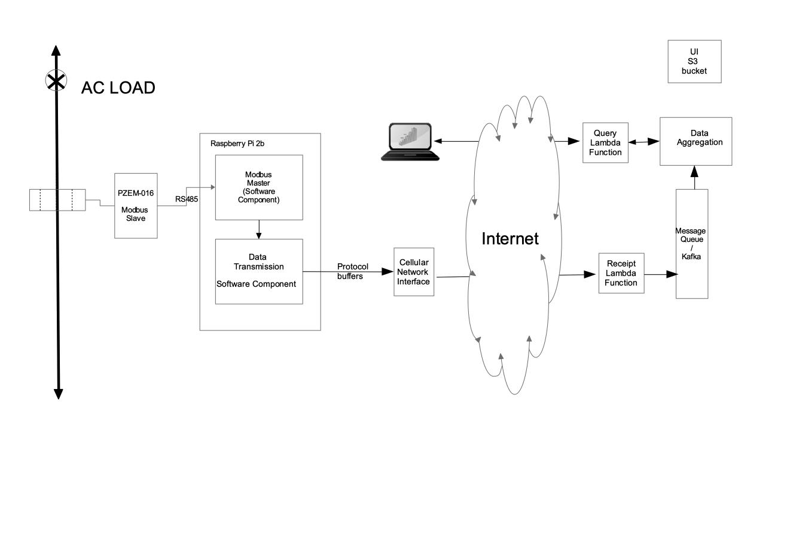

---
---

# Solution Diagram
This diagram is being iteratively evolved. The source odg file is [here](images/Solution-outline.odg)

# Power Measurement

[Power Measurement](power-measurement)

[Turning the PI into a modbus master](modbus-pi-notes)

# Data Transmission 

We are suggesting using protocol buffers for communication between remote devices and the server, sice the are extremely effcient in terms of data transfer. 

[Notes on Protobuffers Here](protocol-buffers)

# Lambda Functions - Serverless

Here are notes on serverless [serverless-stack](serverless-environment)

# Data Aggregation 

We should investigate a time-series database for data aggregation. 

[Amazon Timestream](https://aws.amazon.com/timestream/) may be worth considering as we are working on AWS. However need to investigate how we can run it locally in a docker environment.

